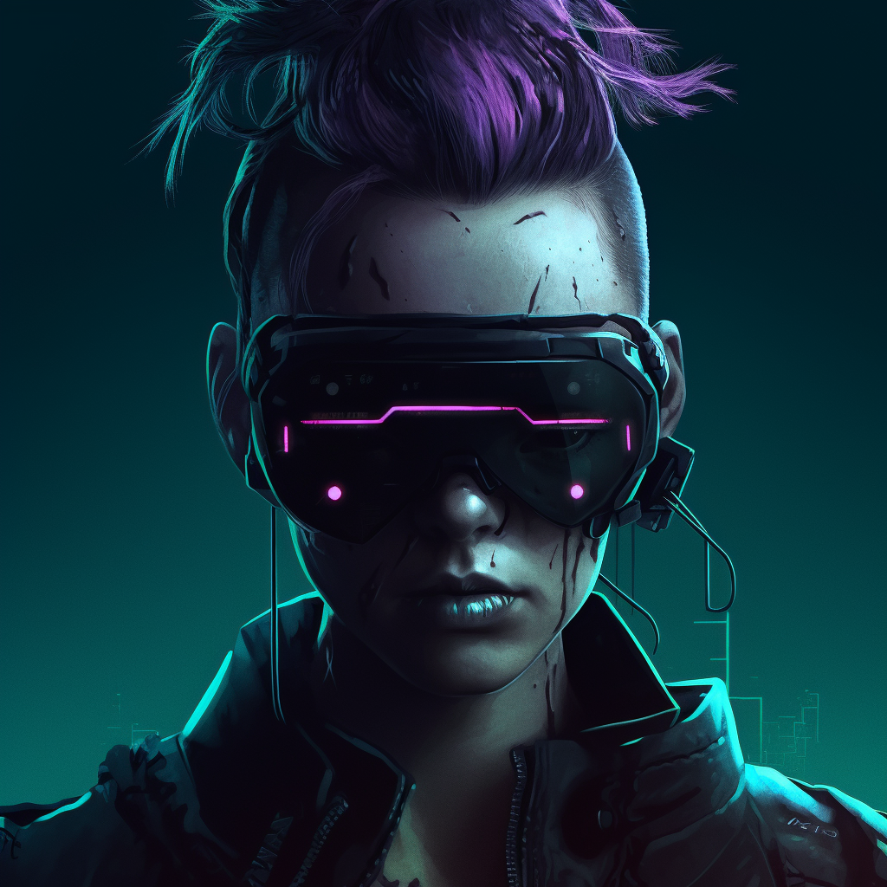

# About NeoWire

NeoWire is more than just a blog—it's a digital window into the heart of Night City. We are an independent platform dedicated to sharing the unfiltered truth and captivating stories that define this sprawling metropolis. As the neon lights flicker and the cybernetic denizens of Night City navigate its streets, NeoWire is here to chronicle their tales.

## Our Mission

At NeoWire, we believe that knowledge is power, and in a world controlled by megacorporations and augmented reality, the truth is often elusive. Our mission is to shine a light on the untold stories, hidden agendas, and everyday heroes that shape the fabric of Night City.

We strive to be the voice of the people, providing a platform for those who refuse to be silenced and ensuring their stories reach the widest possible audience. From the high-rise penthouses to the darkest corners of the CyberSlums, NeoWire goes where others dare not tread, uncovering the realities that lie beneath the surface.

## Our Vision

Our vision is to foster a community of truth-seekers and rebel spirits, united by their passion for the cyberpunk genre and their desire to explore the complexities of Night City. We aim to create an immersive experience that transports readers into the heart of this dystopian world, evoking the sights, sounds, and emotions that define the cyberpunk genre.

## Join the NeoWire Community

We invite you to join our community and become a part of the NeoWire movement. Connect with us on the Night City Wide-Area Network (NCWAN) and engage in thought-provoking discussions, share your own experiences, and contribute to the rich tapestry of stories that make up Night City.

Whether you're an intrepid cyberdeck jockey, a street-smart netrunner, or simply an enthusiast of cyberpunk culture, NeoWire is your gateway to the vibrant, pulsating world of Night City.

Together, let's unravel the mysteries, expose the hidden agendas, and celebrate the spirit of rebellion that defines Night City and the cyberpunk genre.

---

_Follow NeoWire on the Night City Wide-Area Network (NCWAN)_
