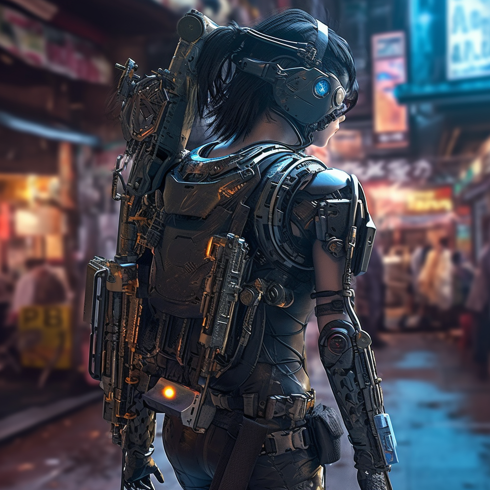
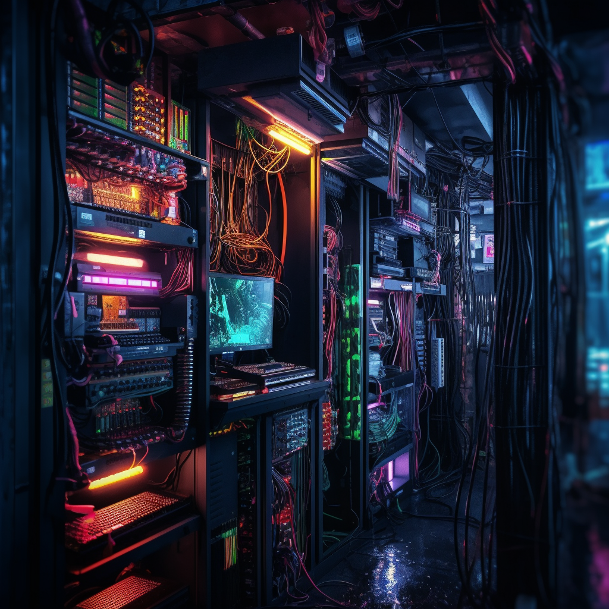

# ~ Datadump #82 ~

```
 ________________________
< corpo runners fuck off >
 ------------------------
        \   ^__^
         \  (oo)\_______
            (__)\       )\/\
                ||----w |
                ||     ||
```

_Welcome, fellow denizens of Night City to Datadump #82.
Within these digital pages, you will uncover a tapestry of hidden truths, daring exploits, and technological marvels that define our existence.
Join us as we venture into the depths of the darknet, explore the wonders of synthetic lifeforms, and grapple with the ethical quandaries of our age.
Together, these three articles provide a glimpse into the underbelly of Night City, where the boundaries between humanity and artificiality blur._

- The Darknet Chronicles: Exploring the Shadows of Night City's Underweb

Plunge into the depths of Night City's underweb — a hidden realm where anonymity reigns and illicit activities thrive. Uncover the secrets of the darknet, its decentralized infrastructure, and the enigmatic figures who navigate its treacherous waters. From black market transactions to covert operations, prepare to witness the underbelly of Night City like never before.

- Cyberware: Bridging the Chasm Between Flesh and Steel

In this thought-provoking essay by c1pher, we explore the profound consequences of cyberware on Night City's inhabitants. As cyberware blurs the boundaries between flesh and steel, it presents a world of endless possibilities while raising concerns about the erosion of humanity. The socioeconomic divide widens as access to cyberware remains unequal, prompting us to question the ethical dilemmas surrounding its integration. Amidst these complexities, c1pher advocates for a balanced approach that embraces the potential of cyberware while safeguarding our human spirit. This article serves as a reminder to navigate this brave new world with careful consideration and a quest for harmony.

- Net Architecture Unveiled: Decoding Night City's Wide-Area-Network

Unravel the intricate tapestry of Night City's WAN, its underlying architecture, and the sprawling networks that connect us all. Discover the hidden nodes, the dark corners of cyberspace, and the ever-present dangers lurking within. Brace yourself for a journey that will challenge your understanding of the digital realm we inhabit.

---

# > The Darknet Chronicles: Exploring the Shadows of Night City's Underweb

## Introduction: Unveiling the Underweb

Welcome, fellow netrunners, to an exposé on Night City's underweb — a clandestine network hidden beneath layers of encryption and anonymity. In this immersive journey, we peel back the digital curtains and venture into the shadows where the underbelly of the city thrives.


## The Anatomy of the Darknet

### Decentralized Infrastructure

Unlike the conventional net, the NCWAN, the underweb operates on a decentralized model, making it resilient to censorship and surveillance. Peer-to-peer connections and encrypted channels form the backbone of this hidden realm, ensuring the privacy and security of its users.

### Darknet Marketplaces

Within the underweb's depths lie notorious darknet marketplaces, digital versions of the illusive 'Night Markets'. These digital bazaars facilitate illicit trades of everything from illegal cyberware to black market weapons. Cryptocurrencies and anonymous transactions are the currency of choice, allowing shadowy figures to conduct their business beyond the prying eyes of law enforcement.

## Navigating the Shadows

### The Hacktivist Elite: Guardians of Anonymity

An elite group of netrunners known as hacktivists guard the underweb's principles of anonymity and freedom. These cyber crusaders dedicate their skills to bypassing surveillance systems, protecting user identities, and fighting against oppressive forces that seek to control the net. Uncover the secret operations and philosophies of these unsung heroes.

### The Deep Web: Secrets of the Unindexed

Beneath the surface of the underweb lies an even deeper layer known as the deep web — a realm inaccessible to traditional search engines. Here, confidential databases, classified government files, and encrypted communication channels thrive, making it a goldmine for those who can navigate its intricacies.

## Darknet Dangers and Consequences

### The Dark Triad: Scammers, Traffickers, and Cybercriminals

The underweb attracts a variety of unsavory characters, including scammers, human traffickers, and cybercriminal syndicates. Expose their methods, understand their motivations, and explore the repercussions of their actions on the citizens of Night City.

### The Thin Line: Ethics and Moral Quandaries

As we navigate the shadows, we inevitably encounter moral gray areas. Uncover the ethical dilemmas faced by netrunners, hackers, and individuals drawn to the underweb's allure. Is there a just cause behind their actions, or are they merely opportunists exploiting the system?

---

# > Cyberware: Bridging the Chasm Between Flesh and Steel

_by c1pher_

---

Cyberware, the amalgamation of flesh and steel, has become an undeniable presence in the sprawling metropolis of Night City. As I reflect upon the implications of this technological marvel, I find myself torn between awe and trepidation. In this article, we delve into the profound consequences of cyberware on our bodies, our identities, and the delicate fabric of our society.

## A New Dawn of Possibilities

With cyberware, we stand at the precipice of human evolution, transcending the limitations imposed upon us by mere biology. Enhanced reflexes, ocular implants that pierce the darkness, and neural interfaces that fuse our minds with machines—these augmentations open doors to extraordinary capabilities once confined to the realm of science fiction. We now possess the power to reshape our bodies and redefine our very existence.



## The Erosion of Humanity

But with every stride towards the future, we must also confront the shadows that loom behind us. As we embrace cyberware, we risk losing touch with our humanity. What defines us as individuals when our flesh is replaced with cold, unyielding metal? Is our essence diminished, our empathy dulled? These questions haunt me as I witness the increasing prevalence of cyberpsychosis—a chilling reminder of the dangers that lie within this uncharted territory.

## The Socioeconomic Divide

While cyberware promises a world of equal opportunities, its reach remains restricted by a stark socioeconomic divide. The privileged few bask in the glory of enhanced bodies, reveling in the advantages it bestows upon them. Meanwhile, the marginalized masses are left grappling with the harsh reality of unattainable enhancements, widening the gap between the haves and have-nots. The disparity in access to cyberware fuels the flames of inequality and threatens to fragment our society further.

## Ethical Crossroads

At the core of the cyberware debate lies a profound ethical quandary. Are we justified in tampering with the essence of humanity? Should the pursuit of progress override our responsibility to preserve our natural selves? We stand at a crossroads, where the decisions we make today will reverberate through the annals of history. It is imperative that we engage in open dialogue, exploring the moral implications and setting guidelines to ensure that the integration of cyberware aligns with our collective values.

## Embracing the Balance

While the implications of cyberware are profound and complex, we must not succumb to fear or reject progress outright. Instead, let us embrace a balanced approach—one that celebrates the boundless potential of cyberware while safeguarding our human spirit. It is in the pursuit of harmony between flesh and steel that we will find a future where the benefits of cyberware can be harnessed without sacrificing our fundamental essence.

## 

As we venture further into the uncharted territories of cyberware, let us not lose sight of our humanity. It is in understanding the implications, grappling with the ethical dilemmas, and striving for balance that we can navigate this brave new world. Our journey continues, and the choices we make today will shape the course of our cyberpunk existence.

---

# > Net Architecture Unveiled: Decoding Night City's Wide-Area-Network

### The Foundation: Nodes, Routers, and Subnets

At the heart of the wide-area-network lies a complex network of interconnected nodes, routers, and subnets. Nodes, represented as data fortresses, house an array of data and serve as gateways to various sections of the net. Routers, the information highways, facilitate the flow of data packets between nodes and subnets, ensuring seamless communication throughout the network.



### The Hierarchy: Megastructures and Mainframes

Scaling the hierarchy, we encounter megastructures and mainframes. Megastructures are colossal data repositories, typically controlled by powerful corporations, housing vast amounts of proprietary information. These towering digital fortresses serve as the backbone of corporate operations and are heavily fortified against unauthorized access.

Mainframes, on the other hand, are specialized nodes that govern the functionality and security of specific subsystems within the net. From managing power grids to overseeing citywide surveillance systems, mainframes act as the control centers for critical infrastructure, making them prime targets for netrunners and rival factions.

### The Intricacies: Firewalls and Intrusion Countermeasures (ICE)

To protect the net from unauthorized intrusions, corporations deploy an arsenal of defensive measures. Firewalls, like impenetrable force fields, shield sensitive data and systems from external threats. Intrusion Countermeasures (ICE) take it a step further, acting as virtual guardians that actively seek out and neutralize unauthorized access attempts. Beware, fellow netrunners, for ICE can range from basic security protocols to deadly autonomous constructs programmed to eliminate any intruders.

### The Sublime: Cybernetic Singularity and Uncharted Realms

Beyond the visible layers of the cybernetic web, whispers of the elusive cybernetic singularity and uncharted realms echo through the digital abyss. Some believe that transcending the boundaries of the net can grant access to undiscovered dimensions of existence, where the limits of perception and reality blur. Tales of netrunners attaining unimaginable powers within these enigmatic realms continue to captivate the netrunning community, fueling our collective curiosity.

### Conclusion

Net architecture is a dynamic and ever-evolving entity that shapes the very fabric of Night City. Understanding its structure and intricacies is paramount for any aspiring netrunner. In our relentless pursuit of knowledge and control, let us not forget the ethical responsibilities that come with our craft. As we delve deeper into the networks, remember to tread carefully, for every action within the net carries consequences.

Stay connected, fellow netrunners, and until next time, happy hacking!

---

_Written by c1pher, your guide through the depths of the net._
