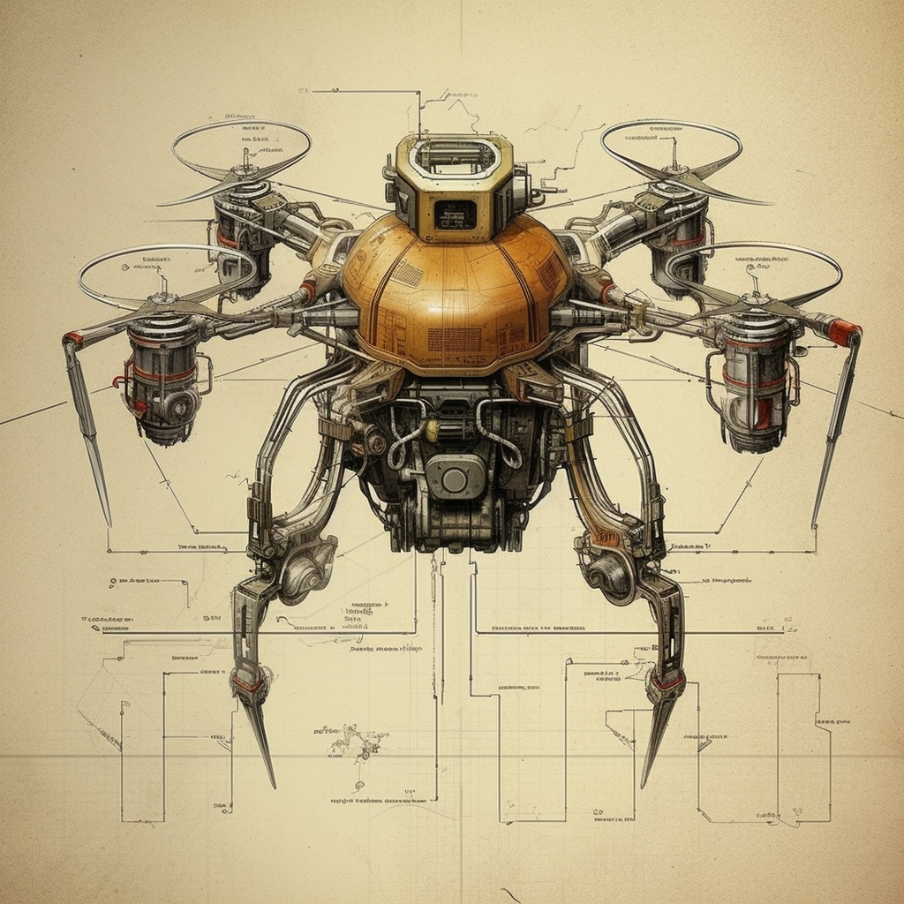
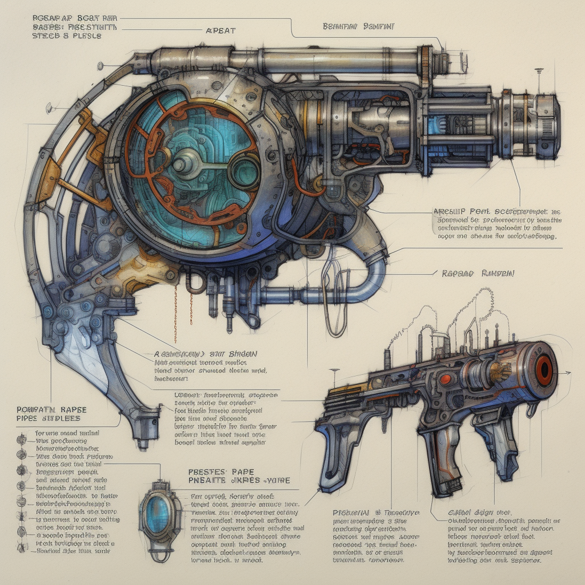
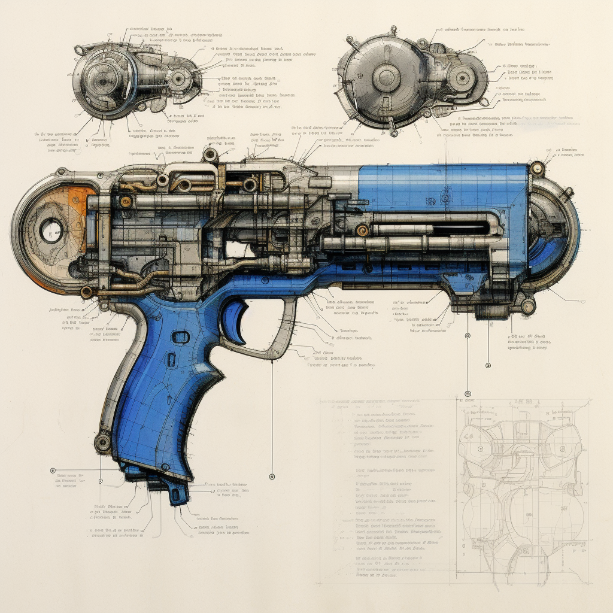
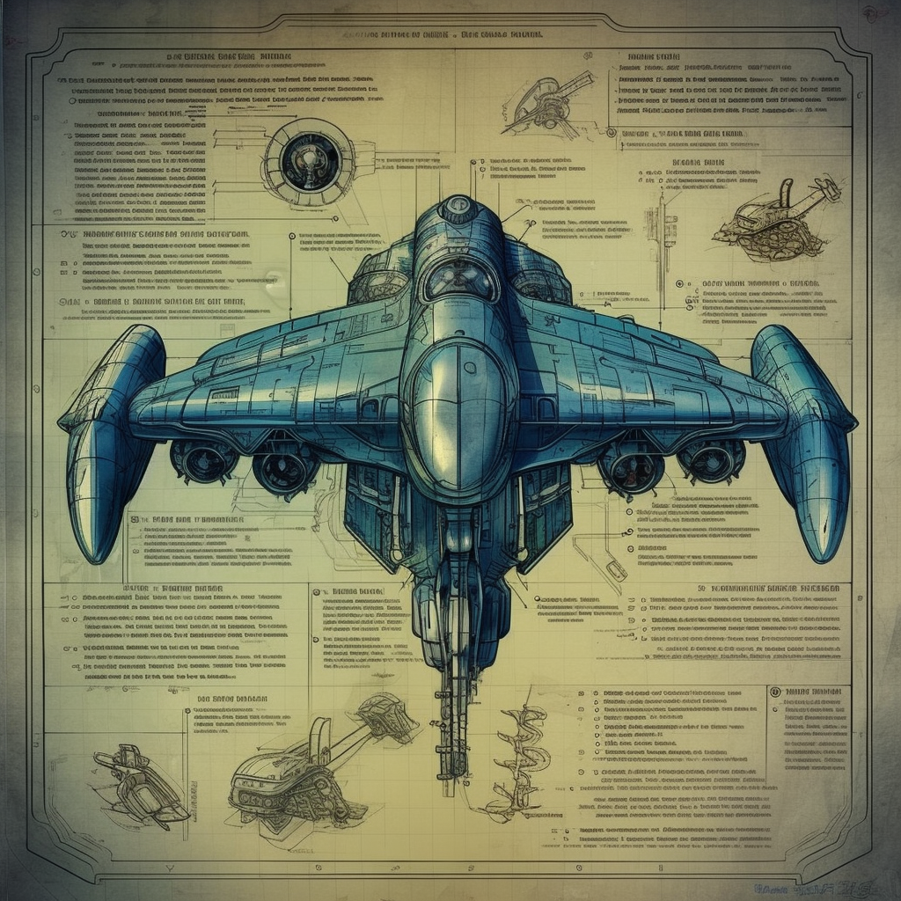
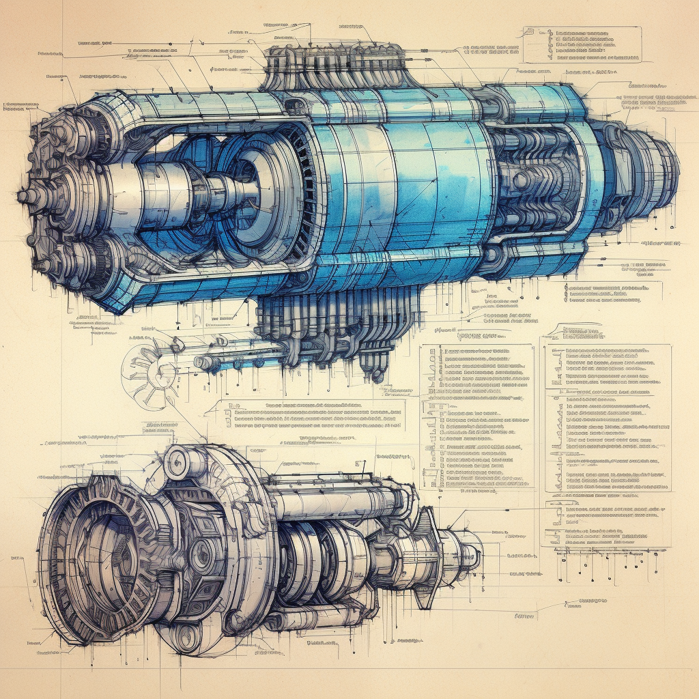
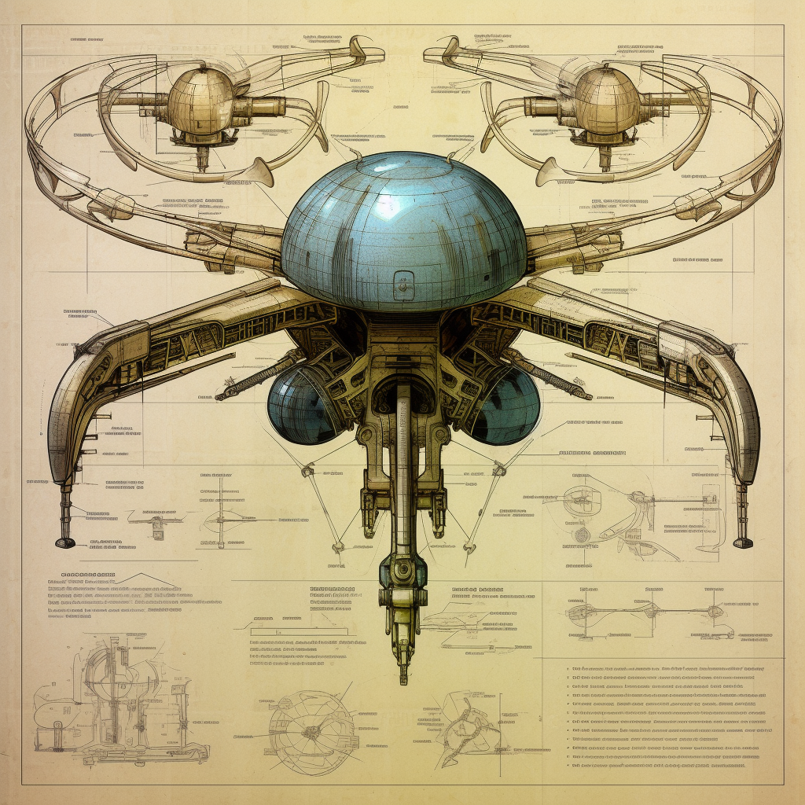

# > Secret Arasaka Military Projects Exposed

_This is a public service announcement from your friendly neighborhood netrunner **Xpl0itM1nd**. Some might call it a data dump, others an exposé. I call it truth._

In a world where power is wielded by those with the deepest pockets and the most extensive arsenals, it's time we pulled back the curtain on the might of Arasaka Corp. You've seen their branded security forces on our streets, their sleek logos on imposing buildings, and their silent drones in our skies. But today, we dive deeper than ever before.

Recently, I managed to carve a path into the heart of Arasaka's servers - the heavily fortified, virtual fortresses that guard their deepest secrets. The mission was not without risk, but truth rarely comes without sacrifice.

What I found there was more than just a collection of zeroes and ones. I uncovered detailed schematics and specifications for Arasaka's latest military tech - machinery of war designed not for our protection, but for our subjugation.

I've laid bare the anatomy of their cutting-edge combat robots, drones, and cybernetic enhancements. Designs that reveal a chilling vision of a future where freedom is a quaint concept, and free will is subject to the whims of an unaccountable corporate board.

The data dump attached to this article provides a comprehensive breakdown of Arasaka's military tech. I encourage all fellow netrunners, tech enthusiasts, and anyone invested in their own freedom to peruse these files. Understand the nature of the beast we're dealing with. Knowledge, after all, is our greatest weapon.

And to Arasaka Corp., consider this a message: We're not your chess pieces. We're not your labor force. We're not your test subjects. We are people, and we will fight for our rights, our lives, and our freedom.

We are the undernet. We are legion. We do not forgive. We do not forget. And we are coming for you.

## #UndernetUnleashed

_This article is accompanied by several encrypted files. These are the blueprints and schematics of Arasaka's military tech, now open for the world to see. Learn, understand, and prepare. Our future depends on it._

_The encrypted schematics were successfully decrypted by SPARKS, **~ the master of cryptography ~** and are embedded in this file for your viewing pleasure._

---

## XC-23

The Arasaka Corporation presents the Quadcopter Drone Model XC-23, a weaponized aerial platform designed for tactical engagements. This cutting-edge drone features a streamlined chassis and advanced aerodynamics, optimizing its maneuverability and reducing wind resistance during flight operations. Equipped with a quad-rotor configuration, the XC-23 ensures enhanced stability and responsive control.

The drone's dual articulated arms are integrated with retractable spike mechanisms, designed to penetrate and disable fortified targets. These spikes are forged from reinforced alloy for increased durability and optimal piercing capabilities. The XC-23 employs an integrated targeting system with advanced image recognition algorithms, enabling autonomous identification and engagement of potential threats.

With its onboard AI processor and data link interface, the Arasaka Quadcopter Drone Model XC-23 operates with exceptional efficiency and adaptability in combat scenarios. Its comprehensive sensor suite provides real-time situational awareness, allowing for swift response and dynamic evasion maneuvers. Engineered with utmost precision, the XC-23 embodies Arasaka's commitment to delivering cutting-edge technology for modern warfare.

Project Name/Model Specification: Arasaka Quadcopter Drone Model XC-23 (Designation: QCD-XC23)

---

## Experimental Plasma Small Arms: PPR-P3X & PRA-R7X

Arasaka Corporation presents its groundbreaking series of experimental plasma small arms, consisting of a pistol and rifle form factor. These cutting-edge weapons harness the raw power of plasma technology, delivering devastating energy-based firepower.

The plasma pistol, designated as the P-3X Plasma Repeater, is a compact sidearm that packs a punch. Its sleek design incorporates an advanced plasma chamber, capable of generating superheated plasma bolts. The P-3X features a semi-automatic firing mode, offering rapid and precise targeting. The weapon's integrated cooling system ensures optimal heat management, enabling sustained firepower without compromising performance.

The plasma rifle, known as the R-7X Plasma Annihilator, is a formidable long-range weapon. Equipped with a larger plasma chamber and an extended barrel, the R-7X projects highly concentrated plasma bolts with enhanced range and destructive capabilities. The rifle boasts a selectable firing mode, allowing for both single shots and devastating bursts of plasma energy. Advanced recoil stabilization technology ensures accuracy and control even during intense firefights.

Both the P-3X and R-7X represent the pinnacle of Arasaka's experimental plasma weaponry, harnessing cutting-edge technology to unleash the destructive power of plasma. With their sleek aesthetics and unrivaled firepower, these small arms are poised to reshape the battlefield.

Project Name/Model Specifications:

- Arasaka Plasma Pistol P-3X Plasma Repeater (Designation: PPR-P3X)
- Arasaka Plasma Rifle R-7X Plasma Annihilator (Designation: PRA-R7X)

---

## ACA-7X

Arasaka Corporation unveils its groundbreaking experimental autonomous combat android, equipped with a sophisticated array of seven optical sensors. This state-of-the-art android, codenamed AC-7X, represents a leap forward in combat robotics, merging advanced artificial intelligence with cutting-edge sensor technology.

Standing at an imposing height, the AC-7X is built with a durable and agile frame, optimized for both offensive and defensive maneuvers. Its integrated optical sensor array encompasses a wide spectrum of visual data, granting the android unparalleled situational awareness and target tracking capabilities.

Each optical sensor utilizes advanced image recognition algorithms, allowing the AC-7X to swiftly identify and classify potential threats with remarkable accuracy. This multi-sensor setup enables the android to perceive its surroundings from various angles, mitigating blind spots and enhancing overall combat effectiveness.

Armed with a range of formidable weapons and modular attachments, the AC-7X is a versatile combatant capable of adapting to diverse mission requirements. Its autonomous AI system empowers the android with independent decision-making, tactical analysis, and adaptable combat strategies, making it a formidable force on the battlefield.

The AC-7X marks Arasaka's bold foray into autonomous combat robotics, fusing cutting-edge technology with lethal efficiency. With its seven optical sensors and advanced AI, this experimental android pushes the boundaries of what is possible in modern warfare.

Project Name/Model Specification: Arasaka Autonomous Combat Android AC-7X (Designation: ACA-7X)

---

## PDD-D7X

Arasaka Corporation introduces its innovative portable anti-drone area denial device, ingeniously designed in a compact pistol form-factor. Named the D-7X Drone Disruptor, this weapon disrupts and neutralizes hostile drones, providing effective countermeasures in both offensive and defensive scenarios.

The D-7X incorporates advanced electronic warfare technology, enabling it to emit powerful electromagnetic pulses (EMPs) in a localized area. These EMPs interfere with the communication and control systems of nearby drones, rendering them temporarily inoperable. The compact design of the pistol form-factor ensures easy handling and swift deployment, making it an ideal solution for rapid response situations.

Equipped with a rechargeable power source, the D-7X offers multiple shots before requiring a recharge, providing sustained anti-drone capabilities in the field. Its intuitive interface and ergonomic grip enhance user comfort and ease of operation, allowing for quick and accurate targeting of hostile drone threats.

The D-7X Pistol Drone Disruptor represents Arasaka's commitment to developing compact and effective solutions to counter the ever-growing drone threats in modern warfare. With its portable and versatile design, this device empowers both individuals and small teams to neutralize enemy drones and assert control over the battlefield.

Project Name/Model Specification: Arasaka D-7X Pistol Drone Disruptor (Designation: PDD-D7X)

---

## AVX-Epsilon-X

Arasaka Corporation proudly presents its groundbreaking experimental AV (Aerial-Vehicle) equipped with an advanced engine module that pushes the boundaries of aerial mobility. This next-generation AV, codenamed Epsilon-X, represents a leap forward in aviation technology, offering unprecedented speed, maneuverability, and versatility.

The Epsilon-X AV showcases an aerodynamically optimized design, combining sleek lines with cutting-edge materials to maximize performance. Its advanced engine module, featuring a fusion of plasma propulsion and advanced fuel injection systems, generates immense thrust while ensuring efficient fuel consumption.

Equipped with state-of-the-art flight control systems and augmented reality interfaces, the Epsilon-X provides a seamless and intuitive piloting experience. Its adaptive flight modes enable precise maneuvering, from high-speed dashes to agile evasive maneuvers, making it an exceptional choice for both civilian and military applications.

The experimental AV's modular design allows for easy customization and mission-specific configurations. With interchangeable payload modules and expandable cargo compartments, the Epsilon-X adapts to a wide range of roles, including transportation, surveillance, and rapid deployment of personnel or supplies.

Arasaka's Epsilon-X AV, with its revolutionary engine module and cutting-edge design, represents the forefront of aerial mobility technology. This experimental platform is poised to redefine the future of aviation, offering unrivaled speed, adaptability, and performance for a multitude of applications.

Project Name/Model Specification: Arasaka Experimental AV Epsilon-X (Designation: AVX-Epsilon-X)

---

## MSD-M5X

Arasaka Corporation introduces its cutting-edge micro surveillance drone, designed to revolutionize covert reconnaissance operations. Aptly named the M-5X MicroEye, this compact drone is a marvel of miniaturization, offering unparalleled versatility and discreet surveillance capabilities.

The M-5X MicroEye boasts a diminutive form factor, enabling it to navigate tight spaces and remain inconspicuous during operations. Equipped with advanced optical sensors and a stabilized camera system, this micro drone captures high-resolution imagery and video, delivering detailed intelligence in real-time.

Its integrated AI algorithms provide autonomous flight capabilities, allowing the M-5X to operate with precision and adapt to dynamic environments. With its silent propulsion system, the drone ensures stealthy surveillance, avoiding detection by both human and technological adversaries.

The M-5X MicroEye's secure wireless data transmission ensures the safe transfer of vital intelligence back to the control center, enhancing situational awareness and supporting informed decision-making. Its extended battery life and swift recharge capabilities enable prolonged surveillance missions, making it a valuable asset for covert operations.

Arasaka's M-5X MicroEye represents the pinnacle of micro drone technology, combining compact size, advanced optics, and autonomous capabilities. This innovative surveillance tool provides unparalleled access to hard-to-reach areas, empowering operatives with crucial intelligence for successful missions.

Project Name/Model Specification: Arasaka Micro Surveillance Drone M-5X MicroEye (Designation: MSD-M5X)

