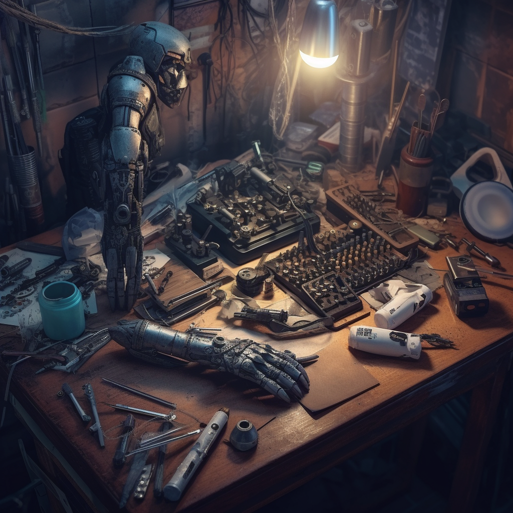
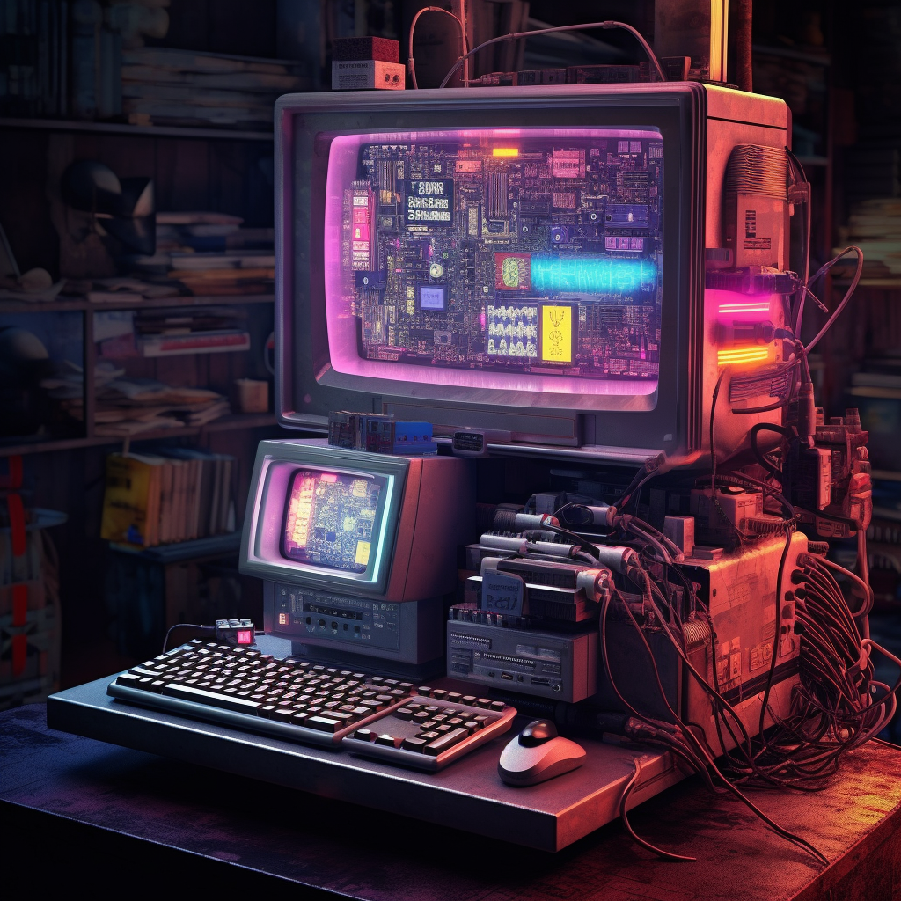
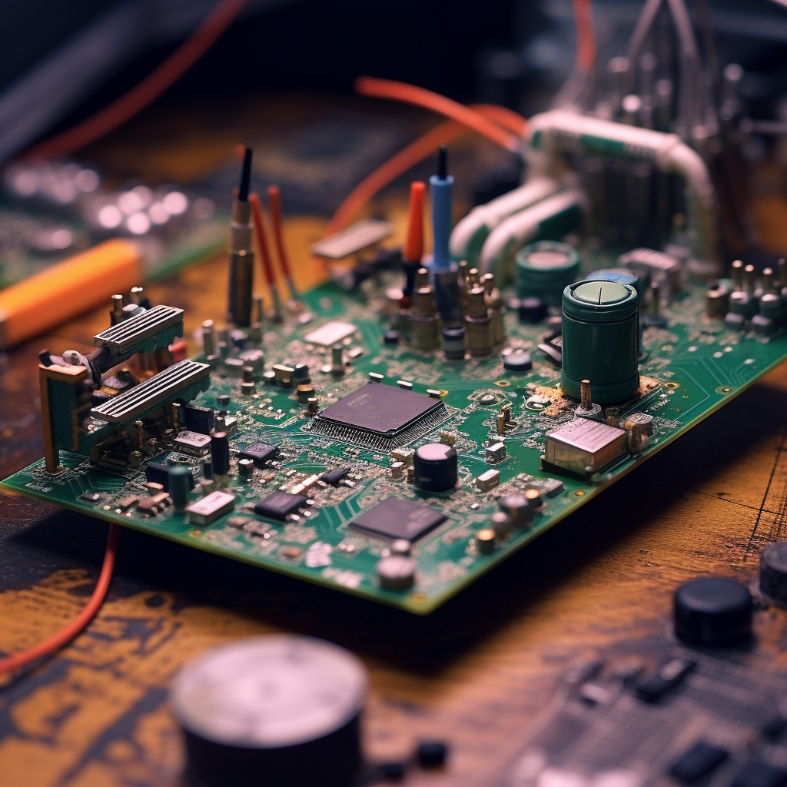
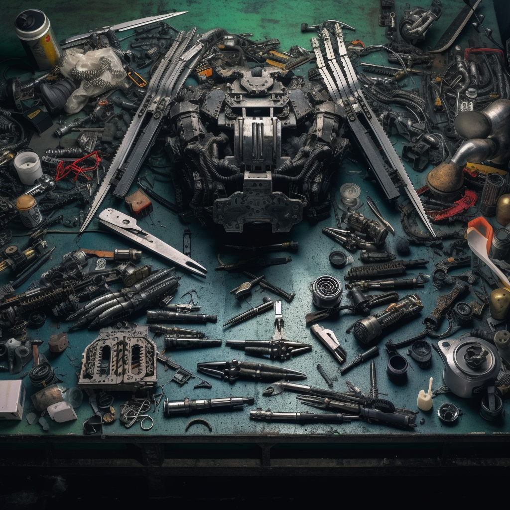
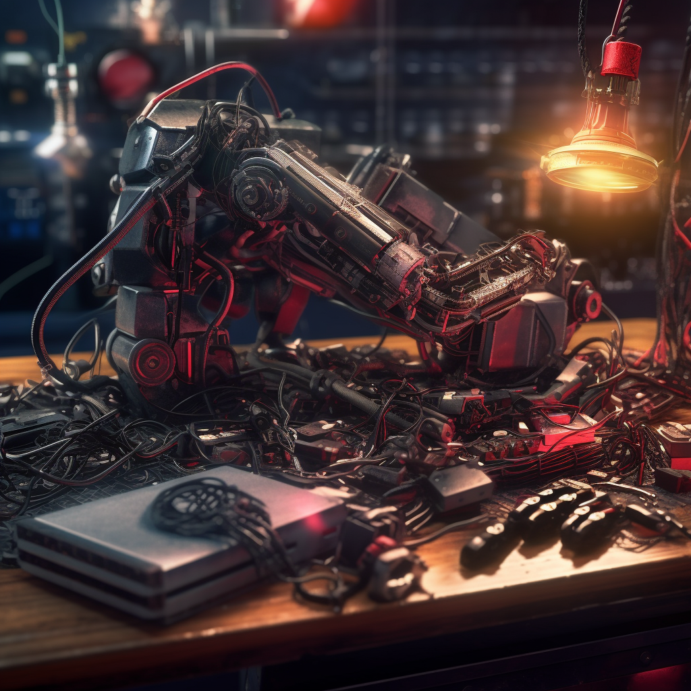

# > Cracking the Shell: A Deep Dive into Hacking the Arasaka BladeRunner X-7 Cyberarm

_Author: c1pher_

## Introduction

Greetings, tech-junkies, code-runners, and thrill-seekers of the neon-lit night. c1pher here, back with another deep dive into the labyrinthine world of the Arasaka BladeRunner X-7 Cyberarm, one of Night City's most fearsome cyberwares. Today, we're not just peeking under the hood, we're ripping it apart, and I'll guide you through the cyber wilderness of manipulating the beast within this beast.



## An Overview

The BladeRunner X-7 isn't just a cyberarm; it's a death sentence waiting to be signed. An ultra-sophisticated augmentation developed by the warlords of Arasaka, this menacing piece of cyberware boasts a retractable blade made from experimental alloys. Designed for combat and with the ability to be concealed when not in use, the BladeRunner X-7 is a masterpiece of lethal engineering. And today, we're going to teach it a new dance.

---

## Gaining Root Shell

Before we initiate our exploit, we first need to get root shell access to the BladeRunner X-7. This requires physical access to the cyberarm, some very specific tools, and a steady hand.

### Step 1: Removing the Right Panels

If you look closely at the BladeRunner X-7's design, you'll notice two small screws hidden in the shadow of the elbow joint. You need a T5 Torx screwdriver to remove these. Keep those screws safe – you don't want your cyberarm falling apart at an inopportune moment.

Once the screws are out, you'll be able to gently lift the synth-skin panel up. Be careful not to pull too hard – the panel is connected to the arm's internal system with a thin data ribbon.

### Step 2: Locating the PCB

Inside, you'll find a marvel of micro-engineering: The main Printed Circuit Board (PCB) of the cyberarm, referred to as the Neuro-Motor Control Board (NM-CB). This little silicon brain, roughly the size of a credit card, controls everything from the twitch of a finger to the lethal thrust of the blade.

### Step 3: Identifying the Debugging Pins

Upon closer inspection of the NM-CB, you'll find a set of unpopulated pins labeled "DBG". These pins, often overlooked, are a debug interface that Arasaka's engineers use to test and debug the cyberarm's firmware during production. It's also our gateway into the system.



> I used the `circuit-specter` to analyze the PCB and find the right pins!

### Step 4: Soldering the UART Interface

With your soldering station heated to about 350°C, you're ready to install a UART (Universal Asynchronous Receiver/Transmitter) interface. Carefully solder a 4-pin header onto the debugging pins.

Here's the pin layout:

```
TX (Transmit)
RX (Receive)
GND (Ground)
VCC (Power)
```



### Step 5: Gaining the Shell

Now, connect the UART interface to your microcontroller using a USB-to-UART converter. Open up your favorite meta-terminal emulator on your cyberdeck and configure it to the correct baud rate (usually 115200 for such devices).

Enter the following command to start a serial communication:

```sh
$ screen /dev/ttyUSB0 --baud-rate 115200 --run /usr/bin/msh
```

If all has been done correctly, you should now be greeted with a root shell on the BladeRunner X-7's internal system. This is where the real fun begins.

```sh
=======================================
                           _
  __ _ _ __ __ _ ___  __ _| | ____ _
 / _` | '__/ _` / __|/ _` | |/ / _` |
| (_| | | | (_| \__ \ (_| |   < (_| |
 \__,_|_|  \__,_|___/\__,_|_|\_\__,_|

- Arasaka BladeRunner X-7 Cyberarm -
=======================================

Starting boot sequence...

[ OK ] Initiated power management...
[ OK ] Activated neuromotor controls...
[ OK ] Calibrated sensory data feed...
[ OK ] Checked limb articulation integrity...

Running diagnostics...

[ OK ] Motor functions: nominal
[ OK ] Sensory data feed: nominal
[ OK ] Power levels: nominal
[ OK ] Subdermal armor integrity: nominal

System diagnostic complete. All systems operational.

=======================================
DEBUG MODE ACTIVE
=======================================

Serial Number: AX7-0921-32B-CT
Firmware Version: 7.1.3
Neuro-motor Kernel Version: 3.2.7

=======================================

root@AX7-0921-32B-CT:~#
```

From here on, you can explore the file system, extract firmware for reverse engineering, and, most importantly, find those juicy vulnerabilities we can exploit to take control of the cyberarm.

---

## Art of Code Injection

We're going to modify the code, injecting some of our own, and making this piece of high-end cyberware dance to our tunes.

### Phase 1: Know Thy Enemy

Every system has its quirks, its own special language. The BladeRunner X-7 controller is written in META like most things these days, which means modifying the code should be so easy even the Arasaka script-kiddies can do it!

### Phase 2: Finding Our Stage

We need to inject our code somewhere that'll be called frequently. Where better than the main function? It's the beating heart of the arm's software, and it's where we're going to slip in our code.
Arasaka's codeheads like to store the source code on their hardware, thinking none of us have the power to reverse engineer it ... Which makes it easy for us to extend the arm with custom functionality!

Let's have a look in the file system, they typically dump their code in `/usr/src`

```sh
root@AX7-0921-32B-CT:~# grep -r "int main" /usr/src
controller.meta
```

See that? The grep command just pinpointed the main function's location.

Let's edit the file, `MetaVim (mvi)` should be installed:

```sh
root@AX7-0921-32B-CT:~# mvi /usr/src/controller.meta
```

### Phase 3: The Grand Performance

We've got our stage. Now, we need an act. We're going to inject some of our own functions right into the main loop of the arm's software.

```c
// file: /usr/src/controller.meta
// Global control flags
bool overrideControl = false;
bool bladeDeployed = false;

// Function to deploy blade
void deployBlade() {
    if(!myArm.isBladeRetracted() || !myArm.isSafeToDeploy()) {
        myArm.displayMsg("Cannot deploy blade");
    } else {
        myArm.toggleBlade();
        myArm.displayMsg("Blade deployed");
        bladeDeployed = true;
    }
}

// Function to retract blade
void retractBlade() {
    if(myArm.isBladeRetracted() || !myArm.isSafeToRetract()) {
        myArm.displayMsg("Cannot retract blade");
    } else {
        myArm.toggleBlade();
        myArm.displayMsg("Blade retracted");
        bladeDeployed = false;
    }
}

int main() {
    // Existing sensor polling and control code...

    // Check for override control
    if(overrideControl) {
        // Check if blade should be deployed
        if(!bladeDeployed) {
            deployBlade();
        }
    } else {
        // If blade is deployed and we're not in override, retract
        if(bladeDeployed) {
            retractBlade();
        }
    }

    // More existing control code...
    return 0;
}
```

We're injecting the `deployBlade()` and `retractBlade()` functions right into the main loop.
This gives us the power to control when that shiny blade comes out to play.

### Phase 4: Take the Bow

With our routine ready, it's time to compile and run it. Let's use the onboard META compiler:

```sh
root@AX7-0921-32B-CT:~# cd /usr/src
root@AX7-0921-32B-CT:/usr/src# metacompile controller.meta
# overwrite the controller with our custom one
root@AX7-0921-32B-CT:/usr/src# cp controller.metabin /usr/bin/
```

No errors? Perfect. Let's get this show on the road:

```sh
root@AX7-0921-32B-CT:/# meta /usr/bin/controller.metabin
```

And there you have it, you've just hacked an Arasaka BladeRunner X-7 cyberarm. Enjoy your newfound power, but remember, with great power... Well, you know the rest.

---



## Further Exploitations

But why stop at the blade? The BladeRunner X-7 is a cybernetic goldmine of features waiting to be exploited.

```c
// Function to lock all controls
void lockdown() {
    // Lock all controls
    myArm.lockAll();

    // Display message to user
    myArm.displayMsg("You've been hacked by c1pher. Good luck.");
}

int main() {
    // Get control
    myArm.getControl();

    if(myArm.hasControl()) {
        // Manipulate arm
        myArm.manipulate();

        // Lockdown the arm
        lockdown();
    }

    return 0;
}
```

Now, isn't that a devious piece of code? This `lockdown()` function doesn't just exploit the blade—it locks the entire arm, rendering it useless.

And to add a cherry on top, it even displays a message to the user.

## Conclusion

Hacking into the BladeRunner X-7 is about more than just the thrill of control. It's about showing that even the most towering corporations are not invincible, and that with the right knowledge, we can make their most feared products dance to our tunes.

As we traverse the deeper waters of the cybernetic world, remember this: Stay curious, stay vigilant, and keep hacking. After all, knowledge is the best weapon in our fight against oppression.

Stay tuned for more adventures into the world of cyberware. Until next time, this is c1pher, signing off.


